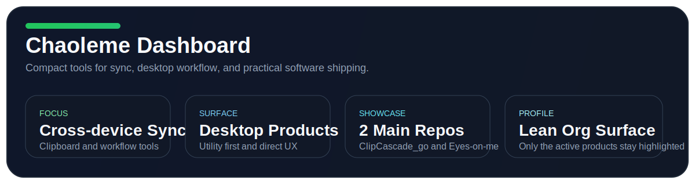
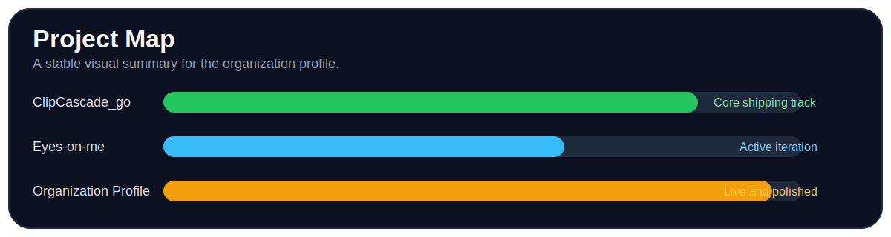
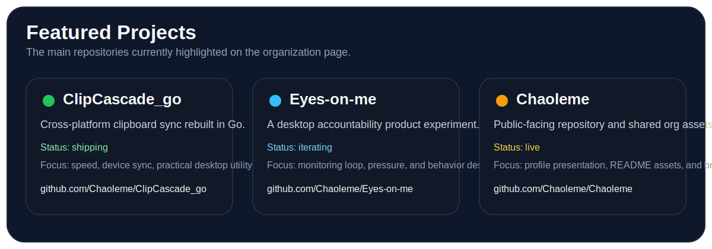

# Chaoleme

Chaoleme builds compact tools around sync, desktop workflows, and practical software ideas.

这里保留组织主页主体，并改成组织账号稳定可用的卡片版本。

## Overview

  

## Featured Projects

  
  
  

  
  
  

## Contribution Snake

## Featured Work

- **[Chaoleme/ClipCascade_go](https://github.com/Chaoleme/ClipCascade_go)** - Cross-platform and cross-device clipboard sync rebuilt in Go.
- **[Chaoleme/Eyes-on-me](https://github.com/Chaoleme/Eyes-on-me)** - A self-monitoring desktop product experiment focused on accountability.
- **[Chaoleme/Chaoleme](https://github.com/Chaoleme/Chaoleme)** - Shared assets and public-facing material for the organization.

## Latest Updates

- [Chaoleme](https://github.com/Chaoleme/Chaoleme) - updated on March 25, 2026
- [Eyes-on-me](https://github.com/Chaoleme/Eyes-on-me) - updated on March 25, 2026
- [ClipCascade_go](https://github.com/Chaoleme/ClipCascade_go) - updated on March 25, 2026

## Development Plans

- [ ] Keep refining `ClipCascade_go` as the core cross-device sync product
- [ ] Continue iterating on `Eyes-on-me` around accountability and desktop UX
- [ ] Keep the organization profile clean and project-focused
- [ ] Ship more compact, practical tools under the `Chaoleme` name

## Support

If any of these projects helped you, star the repository you liked first.

Public sponsorship can be added here later if the organization decides to enable it.

[GitHub](https://github.com/Chaoleme) · [Repositories](https://github.com/Chaoleme?tab=repositories) · [ClipCascade_go](https://github.com/Chaoleme/ClipCascade_go)

  

